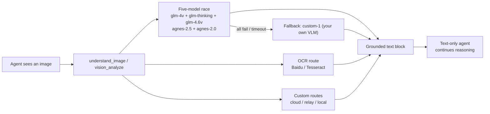

<h1 align="center">vision-mcp</h1>

<p align="center"><strong>Paste an image. Let vision models race. Keep your text-only agent reasoning.</strong></p>

<p align="center">🌐 <a href="README.zh-CN.md">简体中文</a></p>

<p align="center">
  <a href="#quick-start">Quick start</a> ·
  <a href="#routing">Routing</a> ·
  <a href="#register-with-your-agent">Register</a> ·
  <a href="#configuration">Configuration</a> ·
  <a href="#based-on">Based on</a> ·
  <a href="#license">License</a>
</p>

<p align="center">
  
  
  
  
  
</p>

<p align="center"><code>agent sees image → understand_image → race ×5 → fallback → grounded text</code></p>

An **agent-agnostic MCP server** (stdio) that gives text-only models a natural image experience. When the connected agent faces a screenshot, upload, UI snapshot, chart, or scan, it calls `understand_image` / `vision_analyze`. The server races multiple vision providers, returns **grounded text**, and the text-only model keeps reasoning normally.

> [!NOTE]
> This project is a standalone, cleaner re-implementation inspired by
> [`Sorwcyra/ds-vision-plugin`](https://github.com/Sorwcyra/ds-vision-plugin).
> It keeps the same routing philosophy but is **agent-agnostic**, **zero-dependency**, and uses a
> **human-friendly JSONC config** instead of a DeepSeek Harness bundle.

## Why it exists

| Problem | This project's answer |
|---|---|
| Paste screenshots directly into a text-only chat | A standard MCP tool (`understand_image`) any agent can call |
| Don't want to wait on one slow or flaky provider | 5 models start together; first valid result wins |
| Keep a proven multi-provider route design | glm ×3 + agnes ×2 race, user-defined fallback |
| Add a private relay, paid model, or local runtime | Add/reorder any OpenAI-compatible channel |
| Configure without hand-editing confusing YAML | JSONC config with inline comments, hot reload |
| Failures should be understandable | Visible error with full attempt log; images never silently dropped |

## Why choose this MCP

- **Agent-agnostic**: standard MCP stdio — works with Codex, Claude Desktop, Cursor, and any MCP client.
- **Zero third-party dependencies**: pure Python stdlib, `python3` only.
- **Five-model first-success race**: `glm-4v-flash`, `glm-4.1v-thinking-flash`, `glm-4.6v-flash` (⚠️ unstable), `agnes-2.5-flash`, `agnes-2.0-flash`.
- **User-defined fallback**: when all five free racers fail or time out, the server degrades to your own `custom-1` multimodal model.
- **Open-ended routing**: add unlimited OpenAI-compatible channels to the race or the ordered fallback.
- **Explicit failure behavior**: images are never silently discarded; the error includes every attempt.
- **Human-friendly config**: JSONC supports `//` and `#` comments, hot-reloads on save.
- **Caching**: results cached by image content hash (default 7 days) to cut cost and latency.

The five-way race starts five provider requests per uncached image. If request count, cost, or data exposure matters more, remove channels from `routing.race` or prefer local OCR/VLM.

## Routing



- Default route filter is not applied — the server answers any client that asks.
- Missing-key channels are skipped immediately and quietly.
- OCR intent tries Baidu → Tesseract, then falls back to VLM.
- `glm-4.6v-flash` is kept in the race but flagged unstable (rate limits / slow).

## Quick start

### 1) One-command install + register

macOS / Linux:

```bash
# register to Codex
curl -fsSL https://raw.githubusercontent.com/LaconicChip/vision-mcp/main/scripts/install.sh | bash -s codex
# or: bash -s claude / bash -s cursor / bash -s all
```

Windows PowerShell:

```powershell
iex (irm https://raw.githubusercontent.com/LaconicChip/vision-mcp/main/scripts/install.ps1)
```

Already have Python and prefer a package?

```bash
pip install git+https://github.com/LaconicChip/vision-mcp.git
vision-mcp init              # generate ~/.config/vision-mcp/config.json
vision-mcp --status          # then register with your agent's MCP config
```

### 2) Fill in API keys

Edit `~/.mcp-servers/vision-mcp/config.json` — every field has comments. Minimal edits:

- put your GLM key in the `glm` / `glm-thinking` / `glm-4.6v-flash` channels;
- put your Agnes key in the `agnes-*` channels;
- (optional) fill `custom-1` with your own fallback model.

### 3) Test & restart

```bash
python3 ~/.mcp-servers/vision-mcp/server.py --status
python3 ~/.mcp-servers/vision-mcp/server.py --verify /path/to/screenshot.png
```

Restart your agent and paste an image.

> 💡 **No Python?** Download the prebuilt binary for your OS from the **Releases** tab (built by GitHub Actions), and point your agent's MCP config at that binary instead of `python3`.

## Register with your agent

### Codex

```toml
# ~/.codex/config.toml
[mcp_servers.vision-mcp]
type = "stdio"
command = "python3"
args = ["/absolute/path/to/vision-mcp/server.py"]
startup_timeout_sec = 120
```

### Claude Desktop

```json
// claude_desktop_config.json
{
  "mcpServers": {
    "vision-mcp": {
      "command": "python3",
      "args": ["/absolute/path/to/vision-mcp/server.py"]
    }
  }
}
```

### Cursor

```json
// ~/.cursor/mcp.json
{
  "mcpServers": {
    "vision-mcp": {
      "command": "python3",
      "args": ["/absolute/path/to/vision-mcp/server.py"]
    }
  }
}
```

### Any stdio MCP client

```text
command: python3
args: ["/absolute/path/to/vision-mcp/server.py"]
```

`install.py` can print all of these snippets for you:

```bash
python3 install.py --print-clients
```

## Configuration

`config.json` is **JSONC**: comments with `//` or `#` are allowed, and the server hot-reloads on save. See `config.example.json` for the fully commented template.

Each channel is an OpenAI-compatible `chat/completions` endpoint:

```jsonc
{
  "id": "glm",
  "provider": "zhipu",
  "base_url": "https://open.bigmodel.cn/api/paas/v4/chat/completions",
  "model": "glm-4v-flash",
  "api_key": "your-key",          // literal key (priority)
  "api_key_env": "GLM_API_KEY",   // or read from env var
  "timeout_ms": 90000,
  "max_tokens": 2048
}
```

### Built-in channels

| Channel | Model | Key |
|---|---|
| `glm` | glm-4v-flash | `GLM_API_KEY` |
| `glm-thinking` | glm-4.1v-thinking-flash | `GLM_API_KEY` |
| `glm-4.6v-flash` | glm-4.6v-flash (⚠️ unstable) | `GLM_API_KEY` |
| `agnes-2.5-flash` | agnes-2.5-flash | `AGNES_API_KEY` |
| `agnes-2.0-flash` | agnes-2.0-flash | `AGNES_API_KEY` |

> ℹ️ The fallback channel (`custom-1`) is **not** pre-filled. The race pool is free; when all free racers fail or time out, the server degrades to `custom-1` — fill in your own multimodal model's `base_url`, `model` and key in `config.json` (or set `VISION_CUSTOM_API_KEY`).

Add any OpenAI-compatible vision model by adding a channel and putting its id in `routing.race` or `routing.fallback`.

## Tools

| Tool | Returns | Description |
|---|---|---|
| `understand_image(image, prompt?, intent?, complex?, accurate_ocr?, no_cache?, max_tokens?)` | text | One-call image understanding. |
| `vision_analyze(...)` | JSON | Same, plus `tool_used`, `confidence`, `metadata`, race attempts. |
| `vision_config()` | text | Current models / endpoints / masked keys. |
| `vision_status()` | text | Routing, channel readiness, cache, OCR. |

`image` accepts local absolute path, `http(s)://` URL, `data:` URI, or raw base64.
`intent`: `auto` (default) / `reason` / `ocr` / `document`.

## CLI

When installed as a package, use the `vision-mcp` command; from a checkout, use `python3 server.py`:

```bash
vision-mcp --status                 # routing / channel readiness
vision-mcp --verify /path/x.png     # run one real race, print winner
vision-mcp                          # run as MCP stdio server
```

## Privacy & failure behavior

- Image bytes are sent to configured cloud channels; use local OCR/VLM or disable channels for sensitive data.
- Keys are masked in `vision_status` / `vision_config` and never included in status output.
- A channel without a key is skipped; requests never silently drop images.
- On total failure, the tool returns a clear error with every attempt recorded.

## Testing

```bash
python3 -m unittest discover -s tests -v
```

Covers JSONC/legacy/new config parsing, image input parsing, caching, and missing-key skipping.

## Based on

This project adapts the **multi-provider race + fallback** routing from
[`Sorwcyra/ds-vision-plugin`](https://github.com/Sorwcyra/ds-vision-plugin)
(which itself follows the `ds-vision-skill` four-model pattern). Differences:

- **Agent-agnostic MCP** instead of a DeepSeek Harness bundle.
- **Zero third-party dependencies** — pure Python stdlib.
- **JSONC config** with inline comments and hot reload instead of YAML.
- **Five-model race** (adds `glm-4.6v-flash`) with a **user-defined fallback channel** (`custom-1`).
- **Generic install** for Codex / Claude Desktop / Cursor / any MCP client.

## License

Released under the [MIT License](LICENSE).
