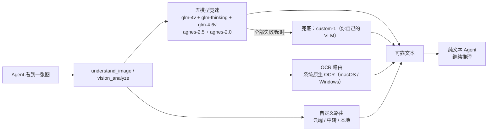

<h1 align="center">vision-mcp</h1>

<p align="center"><strong>贴一张图，让多个视觉模型竞速，纯文本模型也能"看图"。</strong></p>

<p align="center">🌐 <a href="README.md">English</a></p>

<p align="center">
  <a href="#快速开始">快速开始</a> ·
  <a href="#路由">路由</a> ·
  <a href="#注册到你的-agent">注册</a> ·
  <a href="#配置">配置</a> ·
  <a href="#基于">基于</a> ·
  <a href="#开源许可">开源许可</a>
</p>

<p align="center">
  
  
  
  
  
</p>

<p align="center"><code>agent 看到图 → understand_image → 五模型竞速 → 兜底 → 返回可靠文本</code></p>

一个**不限Agent**的 MCP 服务器（stdio），让纯文本模型获得自然的图片输入体验。当连接的 Agent 遇到截图、上传图片、界面截图、图表或扫描件时，底层会调用 `understand_image` / `vision_analyze`。服务器并发调用多个视觉提供商，把结果转成**可靠文本**，纯文本模型继续正常推理。

> [!NOTE]
> 本项目是参考 [`Sorwcyra/ds-vision-plugin`](https://github.com/Sorwcyra/ds-vision-plugin)
> 独立重写的更简洁版本。保留了相同的路由设计思想，但做到 **不限Agent**、**零第三方依赖**，
> 并使用**人类友好的 JSONC 配置**，不再是 DeepSeek Harness 插件。

## 为什么需要它

| 问题 | 本项目的答案 |
|---|---|
| 想把截图直接贴进纯文本对话 | 一个标准 MCP 工具（`understand_image`），任何 Agent 都能调用 |
| 不想被单个视觉服务的慢响应或故障拖住 | 五模型同时启动，首个有效结果获胜 |
| 复用经过验证的多提供商路由思路 | glm ×3 + agnes ×2 竞速，用户自定义保底模型 |
| 接入私有中转、付费模型或本地运行时 | 可添加/调整任意 OpenAI 兼容通道 |
| 不想手工编辑令人困惑的 YAML | JSONC 配置带行内注释，且热重载 |
| 失败时要知道发生了什么 | 可见错误 + 完整尝试记录，绝不静默丢图 |

## 为什么推荐

- **Agent 无关**：标准 MCP stdio，兼容 Codex、Claude Desktop、Cursor 等任意 MCP 客户端。
- **免装 Python**：单文件自包含二进制，覆盖 macOS / Linux / Windows，无需任何环境配置。
- **五模型并发竞速**：`glm-4v-flash`、`glm-4.1v-thinking-flash`、`glm-4.6v-flash`（⚠️ 不稳定）、`agnes-2.5-flash`、`agnes-2.0-flash`，首个有效结果获胜。
- **免费竞速、付费兜底**：竞速池五个模型都是**免费**的；你自己的模型（`custom-1`，付费 / 私有 / 本地均可）只在五路全部失败/超时后才运行，日常请求不花你的钱。
- **路由可自由扩展**：可添加任意数量的 OpenAI 兼容通道，加入并发池或顺序降级队列。
- **失败可见**：图片不会被静默丢弃；报错里包含每一次尝试记录。
- **配置友好**：JSONC 支持 `//` 和 `#` 注释，保存即热重载。
- **缓存**：按图片内容哈希缓存结果（默认 7 天），省钱省延迟。

五路竞速意味着每张未命中缓存的图片最多会同时发起五个请求。如果更在意调用次数、费用或数据暴露，可以从 `routing.race` 删除通道，或改用本地 OCR/视觉模型。

## 路由



- 不绑定特定客户端，任何 Agent 均可调用。
- 缺少 key 的通道会被立即静默跳过。
- OCR 意图使用**系统原生 OCR**——macOS 用 Apple Vision、Windows 用自带 OCR，全程本地离线。
- `glm-4.6v-flash` 保留在竞速里，但标记为不稳定（可能限流/很慢）。

## 快速开始

### 一条命令，什么都不用装（最推荐）

**不用装 Python、不用配置环境、不用区分平台**。运行一条命令，它会自动识别你的系统、下载单文件自包含二进制、安装、注册到你的 Agent，并引导你填写 API Key：

macOS / Linux：

```bash
curl -fsSL https://raw.githubusercontent.com/LaconicChip/vision-mcp/main/scripts/install.sh | bash
```

Windows PowerShell：

```powershell
iex (irm https://raw.githubusercontent.com/LaconicChip/vision-mcp/main/scripts/install.ps1)
```

自动完成的事：

1. 识别系统 / CPU → macOS（arm64 + x86_64）、Linux（x86_64）、Windows（x86_64）。
2. 从 GitHub Releases 下载对应的**单文件二进制**——**无需 Python**。
3. 安装到 `~/.local/bin/vision-mcp`（Windows：`%LOCALAPPDATA%\vision-mcp\vision-mcp.exe`）。
4. 检测到 Codex / Claude Desktop / Cursor 时自动注册。
5. 提示你填写 API Key，重启 Agent，直接粘贴图片就能用。

配置生成在 `~/.config/vision-mcp/config.json`（可随时改，保存即热重载）。如果找不到对应平台的二进制，会自动回退到 `git clone` + Python 方式。

### 或者：让 Agent 自己装

如果你正在用 Codex / Claude / Cursor，直接把仓库链接丢给当前会话即可——**Agent 会把 vision-mcp 装进你正在用的这个 Agent**：

> `install https://github.com/LaconicChip/vision-mcp`

就这么简单，不用复制任何命令。随便怎么说都行（"帮我把这个 MCP 装进当前环境"也可以）。Agent 会克隆仓库、运行安装器、并把自己注册进当前环境。

### 零配置单通道（进阶）

一行指向任意 OpenAI 兼容视觉端点，**完全不需要配置文件**：

```bash
vision-mcp --api-key KEY --base-url https://host/v1/chat/completions --model YOUR_VLM
```

### 其他安装方式（可选）

<details>
<summary>pip / uvx / 源码（需要 Python）</summary>

- **pip**：`pip install git+https://github.com/LaconicChip/vision-mcp.git && vision-mcp init`
- **uvx**：`uvx --from git+https://github.com/LaconicChip/vision-mcp vision-mcp --api-key KEY --base-url URL --model MODEL`
- **源码**：`git clone https://github.com/LaconicChip/vision-mcp && cd vision-mcp && python3 server.py`

</details>

## 注册到你的 Agent

一键安装会在检测到 Codex、Claude Desktop、Cursor 时**自动注册**。想手动注册的话，把任意 MCP 客户端指向已安装的二进制即可（无需 Python）：

### Codex

```toml
# ~/.codex/config.toml
[mcp_servers.vision-mcp]
type = "stdio"
command = "/你的绝对路径/vision-mcp"   # 例如 ~/.local/bin/vision-mcp
args = []
startup_timeout_sec = 120
```

### Claude Desktop / Cursor

```json
// claude_desktop_config.json  /  ~/.cursor/mcp.json
{
  "mcpServers": {
    "vision-mcp": {
      "command": "/你的绝对路径/vision-mcp",
      "args": []
    }
  }
}
```

### 任意 stdio MCP 客户端

```text
command: /你的绝对路径/vision-mcp
args: []
```

> 源码方式运行时改用 `command: python3`、`args: ["/你的绝对路径/vision-mcp/server.py"]`。

## 配置

`config.json` 是 **JSONC**：支持 `//` 和 `#` 注释，保存后自动热重载。完整带注释模板见 `config.example.json`。

每个通道都是一个 OpenAI 兼容的 `chat/completions` 端点：

```jsonc
{
  "id": "glm",
  "provider": "zhipu",
  "base_url": "https://open.bigmodel.cn/api/paas/v4/chat/completions",
  "model": "glm-4v-flash",
  "api_key": "你的key",              // 字面量 key（优先）
  "api_key_env": "GLM_API_KEY",       // 或从环境变量读取
  "timeout_ms": 90000,
  "max_tokens": 2048
}
```

### 内置通道

| 通道 | 模型 | Key |
|---|---|
| `glm` | glm-4v-flash | `GLM_API_KEY` |
| `glm-thinking` | glm-4.1v-thinking-flash | `GLM_API_KEY` |
| `glm-4.6v-flash` | glm-4.6v-flash（⚠️ 不稳定） | `GLM_API_KEY` |
| `agnes-2.5-flash` | agnes-2.5-flash | `AGNES_API_KEY` |
| `agnes-2.0-flash` | agnes-2.0-flash | `AGNES_API_KEY` |

> 🎯 **设计思想**：竞速池用**免费**模型，五个并发跑不花钱。`custom-1` 故意**留空**——它留给**你自己的**模型（付费 / 私有 / 本地中转都可以）。只有当五个免费模型全部失败/超时后才会触发它，所以日常请求不会动用你的付费/私有模型。在 `config.json` 里填它的 `base_url`、`model` 和 key（或设置 `VISION_CUSTOM_API_KEY`）。

添加任意 OpenAI 兼容视觉模型：新增一个通道，并把它的 id 放进 `routing.race` 或 `routing.fallback`。

## 工具

| 工具 | 返回 | 说明 |
|---|---|---|
| `understand_image(image, prompt?, intent?, complex?, accurate_ocr?, no_cache?, max_tokens?)` | 文本 | 一键图片理解。 |
| `vision_analyze(...)` | JSON | 同上，另含 `tool_used`、`confidence`、`metadata`、竞速记录。 |
| `vision_config()` | 文本 | 查看当前模型/地址/打码 key。 |
| `vision_status()` | 文本 | 查看路由、通道可用性、缓存、OCR 状态。 |

`image` 支持：本地绝对路径、`http(s)://` URL、data URI、裸 base64。
`intent`：`auto`（默认）/ `reason` / `ocr` / `document`。

## 命令行

装成包后用 `vision-mcp` 命令；源码方式用 `python3 server.py`：

```bash
vision-mcp --status                 # 路由/通道状态
vision-mcp --verify /path/x.png     # 对一张图跑一次完整竞速，打印获胜模型
vision-mcp --ocr /path/x.png        # 只跑系统原生 OCR（不调模型）
vision-mcp                          # 以 MCP stdio 模式运行
```

## 隐私与失败策略

- 图片字节会发送到已配置的云端通道；敏感图片请使用本地 OCR/视觉模型或停用相关通道。
- OCR 全程**本地离线**——Apple Vision（macOS）/ Windows 自带 OCR，识别时不把图片字节发到任何云端。
- key 在 `vision_status` / `vision_config` 中会被打码，绝不进入状态输出。
- 没有 key 的通道会被跳过；请求绝不会静默丢弃图片。
- 全部失败时，工具会返回带完整尝试记录的明确错误。

## 测试

```bash
python3 -m unittest discover -s tests -v
```

覆盖：JSONC/旧式/新式配置解析、图片输入解析、缓存、缺 key 通道跳过。

## 基于

本项目把 [`Sorwcyra/ds-vision-plugin`](https://github.com/Sorwcyra/ds-vision-plugin)
（其本身沿用了 `ds-vision-skill` 的四模型路由思路）的**多提供商竞速 + 降级**路由适配成了一个通用 MCP。主要差异：

- **Agent 无关的 MCP**，而不是 DeepSeek Harness 插件。
- **零第三方依赖**，纯 Python 标准库。
- **JSONC 配置**，带行内注释并热重载，而不是 YAML。
- **五模型竞速**（新增 `glm-4.6v-flash`），**用户自定义保底通道**（`custom-1`）。
- **通用安装**：兼容 Codex / Claude Desktop / Cursor / 任意 MCP 客户端。

## 开源许可

基于 [MIT License](LICENSE) 开源。
